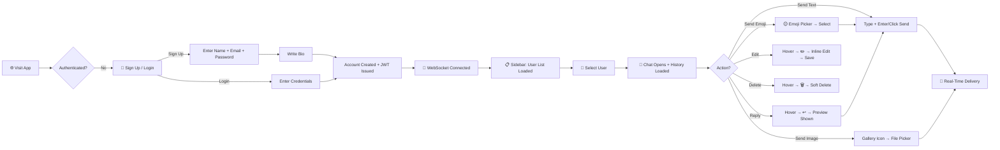
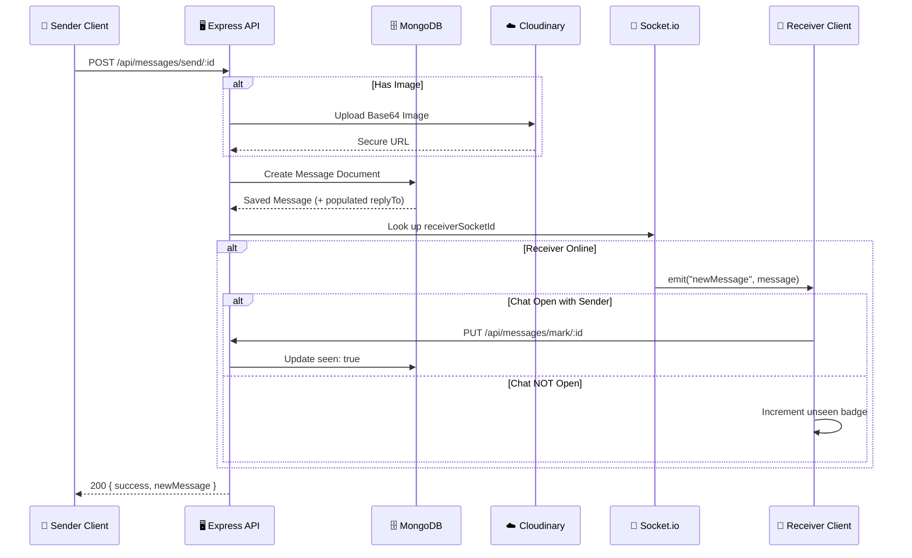
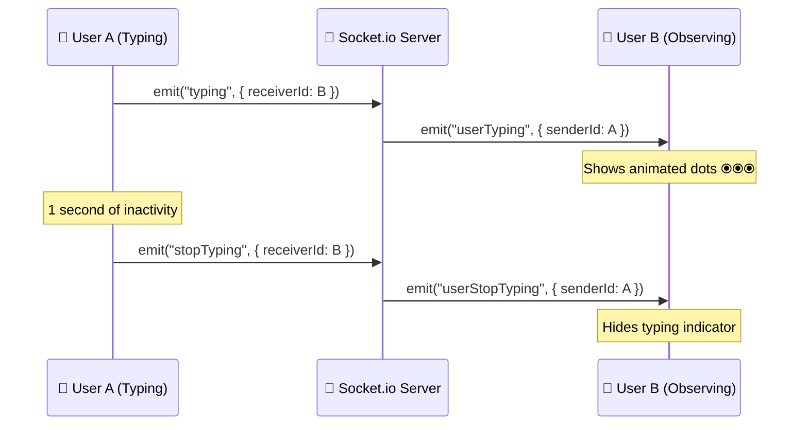
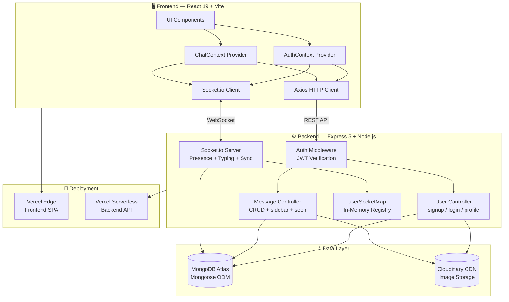
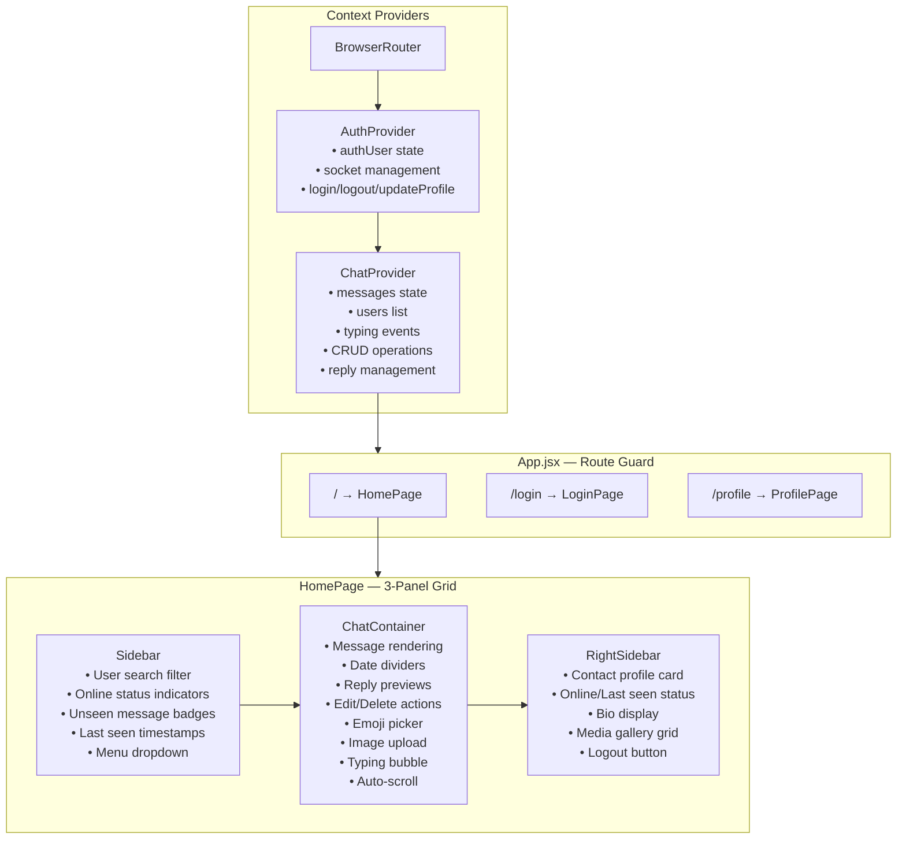
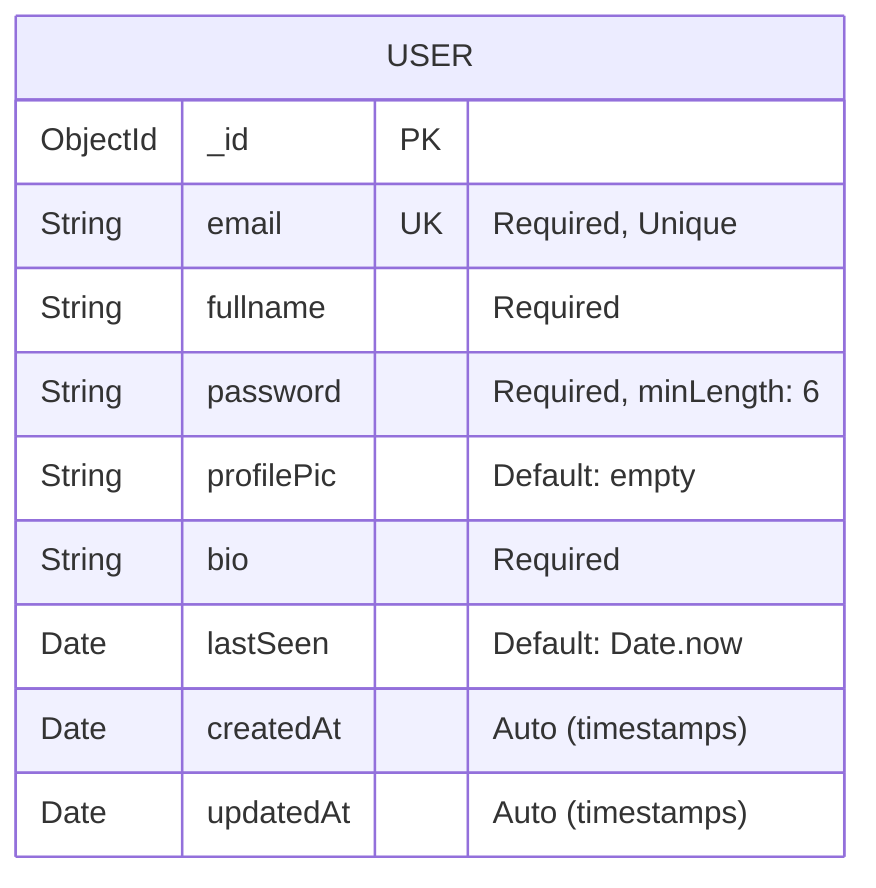
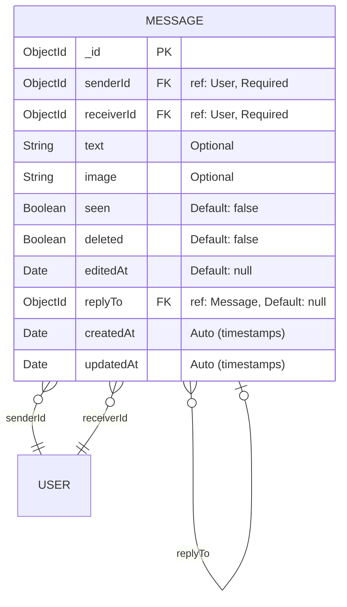

<div align="center">

  <!-- App Screenshots Hero Banner -->
  <div style="display: flex; justify-content: center; gap: 10px;">
 


  </div>

  <br />

  <!-- Logo -->
 

  <h1>⚡ QuickChat — Real-Time Messaging Platform</h1>

  <p>
    <b>A production-grade, feature-rich chat application engineered with a modern MERN stack,<br/>WebSocket-driven real-time communication, and a premium glassmorphic UI.</b>
  </p>

  <p><i>"Where messages travel at the speed of thought."</i></p>

  <!-- Primary Tech Badges -->
  <p>
    
    
    
    
    
    
  </p>

  <!-- Status Badges -->
  <p>
    
    
    
    
    = 18" />
    
  </p>

  <!-- Navigation -->
  <p>
    <a href="#-why-this-project-matters">Why It Matters</a> •
    <a href="#-feature-showcase">Features</a> •
    <a href="#-product-walkthrough">Walkthrough</a> •
    <a href="#%EF%B8%8F-architecture--system-design">Architecture</a> •
    <a href="#-technology-ecosystem">Tech Stack</a> •
    <a href="#-installation--local-development">Installation</a> •
    <a href="#-api-reference">API Docs</a> •
    <a href="#-database-schema">Database</a>
  </p>

</div>

---

## 🌟 Why This Project Matters

<table>
<tr>
<td width="50%">

### 🎯 The Problem
Traditional messaging solutions either rely on expensive PaaS platforms (Firebase, Supabase) creating vendor lock-in, or require massive infrastructure investment. Development teams need a **self-hosted, customizable chat infrastructure** that they fully own and control.

### 💡 The Solution
**QuickChat** is a ground-up implementation of enterprise-grade messaging infrastructure using only open-source technologies. Zero PaaS lock-in. Full architectural control. Production-ready deployment via Vercel's edge network.

</td>
<td width="50%">

### 📊 Technical Innovation
- **Hybrid Communication Model** — REST for heavy operations, WebSockets exclusively for real-time events
- **O(1) Message Routing** — In-memory socket map for instant private message delivery
- **Concurrent Query Optimization** — `Promise.all()` for parallel unread count aggregation
- **15-Minute Edit Window** — Time-gated message editing with real-time sync across clients
- **Soft Delete Architecture** — Preserves conversation integrity while removing content

### 🏢 Target Audience
Startups building embedded chat • SaaS platforms needing messaging modules • Enterprise teams requiring self-hosted communication • Developers learning production WebSocket architecture

</td>
</tr>
</table>

---

## ✨ Feature Showcase

### 🔥 Core Real-Time Engine

<table>
<tr>
<td width="33%" align="center">
  <h4>⚡ Instant Messaging</h4>
  <p>Bi-directional WebSocket communication via Socket.io with automatic reconnection and fallback transport layers. Messages appear instantly with zero perceptible delay.</p>
</td>
<td width="33%" align="center">
  <h4>🟢 Live Presence System</h4>
  <p>Real-time online/offline status broadcast to all connected clients via <code>getOnlineUsers</code> event. In-memory <code>userSocketMap</code> provides O(1) lookup for user connection state.</p>
</td>
<td width="33%" align="center">
  <h4>⌨️ Typing Indicators</h4>
  <p>Live "typing..." bubble animation with intelligent debounce (1s timeout). Socket events (<code>typing</code>/<code>stopTyping</code>) are emitted only to the specific recipient — no broadcast noise.</p>
</td>
</tr>
</table>

### 💬 Advanced Messaging Features

<table>
<tr>
<td width="25%" align="center">
  <h4>✏️ Message Editing</h4>
  <p>Edit sent text messages within a <b>15-minute window</b>. Enforces sender-only permission. Image messages are protected from edits. Edited messages show <code>(edited)</code> indicator. Changes sync to recipient in real-time via <code>messageEdited</code> socket event.</p>
</td>
<td width="25%" align="center">
  <h4>🗑️ Soft Delete</h4>
  <p>Messages are soft-deleted — content is cleared but the record persists, preserving thread integrity. Sender-only permission enforcement. Recipient sees <code>"🚫 This message was deleted"</code> in real-time via <code>messageDeleted</code> socket event.</p>
</td>
<td width="25%" align="center">
  <h4>↩️ Reply Threads</h4>
  <p>Reply to any message (text or image) with contextual preview. Replies are stored as <code>replyTo</code> references populated via Mongoose. Reply context shows original sender name and content preview with a violet accent border.</p>
</td>
<td width="25%" align="center">
  <h4>😊 Emoji Picker</h4>
  <p>Full-featured emoji picker via <code>emoji-picker-react</code> with dark theme, search functionality, and click-outside-to-close behavior. Emojis append directly to the input field for seamless composition.</p>
</td>
</tr>
</table>

### 📊 Intelligent Notification System

<table>
<tr>
<td width="50%" align="center">
  <h4>👁️ Read Receipts & Unseen Counter</h4>
  <p>Every message tracks <code>seen</code> status at the database level. Opening a conversation auto-marks all incoming messages as read. Sidebar displays real-time unseen message badges per user, computed server-side via concurrent <code>Promise.all()</code> queries.</p>
</td>
<td width="50%" align="center">
  <h4>🕐 Last Seen Timestamps</h4>
  <p>Precise <code>lastSeen</code> timestamp updated on WebSocket disconnect. Smart formatting: <code>"just now"</code> → <code>"5 min ago"</code> → <code>"3h ago"</code> → <code>"yesterday"</code> → <code>"Jun 10"</code>. Displayed in sidebar and right panel for offline users.</p>
</td>
</tr>
</table>

### 🖼️ Rich Media & Profile Management

<table>
<tr>
<td width="33%" align="center">
  <h4>☁️ Cloudinary Integration</h4>
  <p>Profile pictures and image messages are uploaded via Base64 → Cloudinary pipeline. Secure <code>https://</code> URLs served from Cloudinary CDN. Supports PNG and JPEG formats with client-side MIME type validation.</p>
</td>
<td width="33%" align="center">
  <h4>👤 Dynamic Profiles</h4>
  <p>Full profile CRUD — update display name, bio, and avatar anytime. Changes reflect immediately across all active sessions. Multi-step sign-up flow collects name/email → bio for progressive profiling.</p>
</td>
<td width="33%" align="center">
  <h4>🖼️ Media Gallery</h4>
  <p>Right sidebar aggregates all shared images from the current conversation into a browseable grid gallery. Click-to-open functionality launches full-resolution images in new tabs.</p>
</td>
</tr>
</table>

### 🔐 Security & Authentication

<table>
<tr>
<td width="25%" align="center"><b>JWT Auth</b><br/>Stateless token-based authentication via <code>jsonwebtoken</code>. Token stored in <code>localStorage</code> and sent via custom header.</td>
<td width="25%" align="center"><b>bcrypt Hashing</b><br/>Passwords hashed with 10-round salt via <code>bcryptjs</code>. Raw passwords never stored or logged.</td>
<td width="25%" align="center"><b>Route Protection</b><br/>Server-side middleware validates JWT on every protected route. Client-side route guards redirect unauthenticated users.</td>
<td width="25%" align="center"><b>Payload Limits</b><br/>Strict 15MB request body limit prevents oversized payload attacks and memory exhaustion.</td>
</tr>
</table>

### 🎨 Premium UI/UX

<table>
<tr>
<td width="50%">

- **Glassmorphic Design** — `backdrop-blur-xl`, semi-transparent panels, and gradient accents create a modern depth effect
- **Outfit Typography** — Google Fonts `Outfit` family loaded across all weights for clean, contemporary text rendering
- **Gradient CTAs** — Purple-to-violet gradient buttons (`from-purple-400 to-violet-600`) for primary actions
- **Hidden Scrollbars** — Custom CSS hides all scrollbar chrome for a clean, app-like experience

</td>
<td width="50%">

- **Responsive 3-Panel Layout** — Adaptive grid: 3-column on desktop (`[1fr_2fr_1fr]`), single column on mobile with toggle navigation
- **Smart Date Dividers** — Messages grouped by date with styled pills showing "Today", "Yesterday", or full date
- **Hover Action Menus** — Context actions (reply, edit, delete) appear on message hover, hidden otherwise for clean UI
- **Toast Notifications** — `react-hot-toast` for immediate, non-blocking feedback on every user action

</td>
</tr>
</table>

---

## 🗺️ Product Walkthrough

### User Journey — From Sign Up to First Message



### Real-Time Message Lifecycle



### Typing Indicator Flow



---

## 🏗️ Architecture & System Design

### High-Level System Overview



### Frontend Component Architecture



---

## 🛠️ Technology Ecosystem

<table>
<tr>
<th align="center">Layer</th>
<th align="center">Technology</th>
<th align="center">Version</th>
<th align="center">Purpose</th>
</tr>
<tr><td colspan="4" align="center"><b>🖥️ Frontend</b></td></tr>
<tr><td>Core</td><td></td><td>19.1.0</td><td>Declarative UI with latest concurrent features</td></tr>
<tr><td>Build</td><td></td><td>6.3.5</td><td>Sub-second HMR, optimized production builds</td></tr>
<tr><td>Routing</td><td></td><td>7.6.2</td><td>SPA navigation with route guards</td></tr>
<tr><td>Styling</td><td></td><td>4.1.10</td><td>Utility-first CSS with v4 compiler via Vite plugin</td></tr>
<tr><td>Typography</td><td></td><td>—</td><td>Outfit + Poppins + Playfair font families</td></tr>
<tr><td>HTTP</td><td></td><td>1.10.0</td><td>Promise-based HTTP client with interceptors</td></tr>
<tr><td>Emoji</td><td></td><td>4.19.1</td><td>Full emoji keyboard with search & dark theme</td></tr>
<tr><td>Notifications</td><td></td><td>2.5.2</td><td>Lightweight, customizable toast system</td></tr>
<tr><td>Real-Time</td><td></td><td>4.8.1</td><td>WebSocket client with auto-reconnect</td></tr>
<tr><td colspan="4" align="center"><b>⚙️ Backend</b></td></tr>
<tr><td>Runtime</td><td></td><td>≥18</td><td>JavaScript runtime with ES Module support</td></tr>
<tr><td>Framework</td><td></td><td>5.1.0</td><td>Latest Express v5 with async error handling</td></tr>
<tr><td>Real-Time</td><td></td><td>4.8.1</td><td>Event-driven WebSocket server</td></tr>
<tr><td>ODM</td><td></td><td>8.16.0</td><td>Schema validation, population, indexing</td></tr>
<tr><td>Auth</td><td></td><td>9.0.2</td><td>JWT generation & verification</td></tr>
<tr><td>Hashing</td><td></td><td>3.0.2</td><td>10-round salted password hashing</td></tr>
<tr><td>Media</td><td></td><td>2.7.0</td><td>CDN-backed image upload & hosting</td></tr>
<tr><td>Security</td><td></td><td>2.8.5</td><td>Cross-origin request control</td></tr>
<tr><td>Env</td><td></td><td>16.5.0</td><td>Environment variable management</td></tr>
<tr><td colspan="4" align="center"><b>🚀 Deployment & DevOps</b></td></tr>
<tr><td>Hosting</td><td></td><td>—</td><td>Edge deployment with serverless functions</td></tr>
<tr><td>Database</td><td></td><td>—</td><td>Managed cloud NoSQL database</td></tr>
<tr><td>Dev Server</td><td></td><td>3.1.10</td><td>Auto-restart on file changes</td></tr>
<tr><td>Linting</td><td></td><td>9.25.0</td><td>Code quality enforcement</td></tr>
</table>

---

## 🏆 Key Achievements & Engineering Highlights

> **📋 Recruiter Quick Reference** — These accomplishments demonstrate production-level engineering capabilities across full-stack development, real-time systems, API design, and modern frontend architecture.

<table>
<tr>
<th width="40%">🎖️ Achievement</th>
<th width="60%">📝 Technical Details</th>
</tr>
<tr>
<td><b>Hybrid REST + WebSocket Architecture</b></td>
<td>Designed a dual-protocol communication system: REST APIs (Axios) handle stateless operations (auth, message history, profile updates) while WebSockets (Socket.io) are reserved exclusively for ephemeral real-time events (presence, typing, live message sync). This separation optimizes server load and maintains clean architectural boundaries.</td>
</tr>
<tr>
<td><b>O(1) Private Message Routing</b></td>
<td>Implemented an in-memory <code>userSocketMap</code> dictionary (<code>{userId → socketId}</code>) enabling constant-time lookup for targeting specific connected clients. Eliminates broadcast overhead for private messages.</td>
</tr>
<tr>
<td><b>Concurrent Database Query Optimization</b></td>
<td>Sidebar unseen message counts are computed using <code>Promise.all()</code> across all users simultaneously, reducing N sequential queries to a single parallel batch — cutting API response time by up to N×.</td>
</tr>
<tr>
<td><b>Time-Gated Message Editing</b></td>
<td>Engineered a 15-minute edit window with server-side timestamp validation (<code>Date.now() - createdAt</code>), sender-only permission checks, deleted-message guards, and image-message protection — mirroring production messaging platform patterns (WhatsApp, Slack).</td>
</tr>
<tr>
<td><b>Soft Delete with Thread Preservation</b></td>
<td>Messages are logically deleted (<code>deleted: true</code>) with content cleared but record preserved, maintaining referential integrity for reply threads. Real-time sync via dedicated <code>messageDeleted</code> socket event.</td>
</tr>
<tr>
<td><b>Threaded Reply System with Population</b></td>
<td>Implemented reply-to-message functionality with Mongoose <code>populate('replyTo', 'text image senderId deleted')</code> for efficient reference resolution. UI renders contextual reply previews with sender attribution.</td>
</tr>
<tr>
<td><b>Intelligent Presence & Last Seen</b></td>
<td>Dual presence system: real-time online status via WebSocket connection events + persistent <code>lastSeen</code> timestamp updated on disconnect. Client-side relative time formatting with 5 granularity levels.</td>
</tr>
<tr>
<td><b>Debounced Typing Indicators</b></td>
<td>Client-side typing events use <code>setTimeout</code> debouncing (1s) to prevent event flooding. Server routes typing events only to the specific recipient via socket map lookup — zero broadcast overhead.</td>
</tr>
<tr>
<td><b>Express 5 Early Adoption</b></td>
<td>Built on Express v5.1.0, leveraging native async error handling and modern middleware patterns ahead of the ecosystem.</td>
</tr>
<tr>
<td><b>React 19 + Tailwind v4 Cutting-Edge Stack</b></td>
<td>Frontend built with React 19's latest rendering improvements and Tailwind CSS v4's new compiler architecture via native Vite plugin integration — demonstrating ability to work with bleeding-edge tooling.</td>
</tr>
</table>

---

## 📐 Technical Excellence

<details>
<summary><b>🧩 Design Patterns & Architecture Decisions</b></summary>
<br/>

| Pattern | Implementation |
|---------|---------------|
| **Provider Pattern** | `AuthProvider` and `ChatProvider` Context wrappers manage global state, avoiding prop drilling across the component tree |
| **Controller-Route Separation** | Express routes delegate to dedicated controller functions, keeping routing thin and business logic testable |
| **Middleware Chain** | `protectRoute` middleware handles JWT verification and user hydration before any protected controller executes |
| **Observer Pattern** | Socket.io event listeners (`newMessage`, `messageDeleted`, `messageEdited`, `userTyping`) implement reactive state updates |
| **Optimistic UI** | Messages appear in the sender's UI immediately via local state update, with server confirmation arriving asynchronously |
| **Progressive Disclosure** | Sign-up form uses a two-step flow (credentials → bio) to reduce cognitive load |
| **Graceful Degradation** | Socket.io auto-fallback from WebSocket to long-polling in restrictive network environments |

</details>

<details>
<summary><b>🔒 Security Implementation</b></summary>
<br/>

| Layer | Mechanism | Details |
|-------|-----------|---------|
| **Password Storage** | bcrypt (10 rounds) | Salted hashing; raw passwords never persisted |
| **Authentication** | JWT tokens | Stateless auth; token sent via custom `token` header |
| **Route Protection** | Server middleware | Every protected endpoint validates JWT and hydrates `req.user` |
| **Client Guards** | React Router | `Navigate` redirects enforce auth state on every route |
| **Payload Defense** | Express body limit | 15MB max request size prevents memory exhaustion |
| **CORS** | `cors()` middleware | Cross-origin request control on all API endpoints |
| **Data Filtering** | `.select("-password")` | Password hash excluded from all user queries |
| **Authorization** | Controller-level checks | Message edit/delete operations verify `senderId === userId` |

</details>

<details>
<summary><b>⚡ Performance Optimizations</b></summary>
<br/>

| Optimization | Impact |
|--------------|--------|
| **Parallel Query Execution** | `Promise.all()` for sidebar unseen counts — N× faster than sequential |
| **In-Memory Socket Registry** | O(1) user → socket lookup eliminates database queries for routing |
| **Selective Socket Events** | Typing & message events sent only to specific recipients, not broadcast |
| **Vite Build System** | Sub-second HMR in development, optimized chunking in production |
| **Tailwind v4 Compiler** | New compiler generates smaller CSS output with faster build times |
| **Hidden Scrollbars** | CSS-only approach (no JS scroll libraries) for zero overhead |
| **CDN Image Delivery** | Cloudinary serves images from globally distributed edge nodes |
| **Smooth Auto-Scroll** | `scrollIntoView({ behavior: "smooth" })` with ref-based targeting |

</details>

---

## 📡 API Reference

### Authentication Endpoints

| Method | Endpoint | Auth | Description |
|--------|----------|------|-------------|
| `POST` | `/api/auth/signup` | ❌ | Register new user with name, email, password, bio |
| `POST` | `/api/auth/login` | ❌ | Authenticate user, returns JWT token |
| `GET` | `/api/auth/check` | ✅ | Validate JWT and return user data |
| `PUT` | `/api/auth/update-profile` | ✅ | Update fullname, bio, and/or profilePic |

### Messaging Endpoints

| Method | Endpoint | Auth | Description |
|--------|----------|------|-------------|
| `GET` | `/api/messages/users` | ✅ | Get all users (excluding self) + unseen message counts |
| `GET` | `/api/messages/:id` | ✅ | Fetch full message history with a specific user |
| `POST` | `/api/messages/send/:id` | ✅ | Send text/image message with optional replyTo reference |
| `PUT` | `/api/messages/mark/:id` | ✅ | Mark a specific message as seen |
| `PUT` | `/api/messages/edit/:id` | ✅ | Edit message text (15-min window, sender only, text only) |
| `DELETE` | `/api/messages/delete/:id` | ✅ | Soft-delete a message (sender only) |

### WebSocket Events

| Event | Direction | Payload | Description |
|-------|-----------|---------|-------------|
| `getOnlineUsers` | Server → Client | `string[]` (userIds) | Broadcast online user list on connect/disconnect |
| `newMessage` | Server → Client | `Message` object | Deliver new message to recipient |
| `messageDeleted` | Server → Client | `{ messageId }` | Notify recipient of message deletion |
| `messageEdited` | Server → Client | `{ messageId, text, editedAt }` | Sync edited message to recipient |
| `typing` | Client → Server | `{ receiverId }` | Notify server that user is typing |
| `stopTyping` | Client → Server | `{ receiverId }` | Notify server that user stopped typing |
| `userTyping` | Server → Client | `{ senderId }` | Relay typing status to specific recipient |
| `userStopTyping` | Server → Client | `{ senderId }` | Relay stop-typing to specific recipient |

### Health Check

| Method | Endpoint | Description |
|--------|----------|-------------|
| `GET` | `/api/status` | Returns `"Server is Live"` |

---

## 🗄️ Database Schema

### User Collection



### Message Collection



---

## 📂 Project Structure

```
QuickChat/
├── 📄 README.md                          # This file
├── 📄 .gitignore                         # Git ignore rules
│
├── 📁 client/                            # Frontend Application
│   └── 📁 my-react-app/
│       ├── 📄 index.html                 # SPA entry point
│       ├── 📄 vite.config.js             # Vite + React + Tailwind v4 config
│       ├── 📄 vercel.json                # Client-side Vercel SPA rewrites
│       ├── 📄 package.json               # Frontend dependencies
│       ├── 📄 eslint.config.js           # ESLint configuration
│       ├── 📄 .env                       # VITE_BACKEND_URL
│       │
│       ├── 📁 context/                   # React Context Providers
│       │   ├── 📄 AuthContext.jsx        # Auth state, socket, login/logout/profile
│       │   └── 📄 ChatContext.jsx        # Messages, users, typing, CRUD, replies
│       │
│       ├── 📁 src/
│       │   ├── 📄 main.jsx               # App bootstrap (BrowserRouter + Providers)
│       │   ├── 📄 App.jsx                # Route definitions + auth guards
│       │   ├── 📄 index.css              # Global styles (Outfit font, Tailwind import)
│       │   │
│       │   ├── 📁 pages/
│       │   │   ├── 📄 HomePage.jsx       # 3-panel layout (Sidebar + Chat + RightSidebar)
│       │   │   ├── 📄 LoginPage.jsx      # Multi-step login/signup form
│       │   │   └── 📄 ProfilePage.jsx    # Profile editing with image upload
│       │   │
│       │   ├── 📁 components/
│       │   │   ├── 📄 Sidebar.jsx        # User list, search, online status, unseen badges
│       │   │   ├── 📄 ChatContainer.jsx  # Message display, input, emoji, reply, edit/delete
│       │   │   └── 📄 RightSidebar.jsx   # Contact info, bio, media gallery
│       │   │
│       │   ├── 📁 lib/
│       │   │   └── 📄 utils.js           # formatMessageTime, formatLastSeen, formatDateHeader
│       │   │
│       │   └── 📁 assets/                # Static assets (icons, images, SVGs)
│       │       └── 📄 assets.js          # Asset imports + dummy data exports
│       │
│       └── 📁 public/                    # Vite public directory
│
└── 📁 server/                            # Backend Application
    ├── 📄 server.js                      # Express + HTTP + Socket.io setup, entry point
    ├── 📄 vercel.json                    # Vercel serverless function config
    ├── 📄 package.json                   # Backend dependencies
    ├── 📄 .env                           # Environment variables
    │
    ├── 📁 controllers/
    │   ├── 📄 userController.js          # signup, login, checkAuth, updateProfile
    │   └── 📄 messageController.js       # getUserForSidebar, getMessages, sendMessage,
    │                                     # markMessageAsSeen, deleteMessage, editMessage
    │
    ├── 📁 models/
    │   ├── 📄 User.js                    # Mongoose User schema
    │   └── 📄 Message.js                 # Mongoose Message schema (with replyTo, deleted, editedAt)
    │
    ├── 📁 routes/
    │   ├── 📄 userRoutes.js              # /api/auth/* routes
    │   └── 📄 messageRoutes.js           # /api/messages/* routes
    │
    ├── 📁 middleware/
    │   └── 📄 auth.js                    # JWT verification + user hydration middleware
    │
    └── 📁 lib/
        ├── 📄 db.js                      # MongoDB connection via Mongoose
        ├── 📄 cloudinary.js              # Cloudinary v2 SDK configuration
        └── 📄 utils.js                   # JWT token generation helper
```

---

## 🚀 Installation & Local Development

### Prerequisites

| Requirement | Minimum Version | Purpose |
|------------|----------------|---------|
| **Node.js** | v18+ | Runtime environment |
| **npm** | v9+ | Package management |
| **MongoDB** | v6+ (or Atlas) | Database |
| **Cloudinary Account** | Free tier | Image CDN |

### 1. Clone the Repository

```bash
git clone https://github.com/SarthakDudhe/ChatApplication.git
cd ChatApplication
```

### 2. Backend Setup

```bash
cd server
npm install
```

Create a `.env` file in the `server/` directory:

```env
# Server Configuration
PORT=5000
NODE_ENV=development

# MongoDB Connection
MONGODB_URI=mongodb+srv://<username>:<password>@cluster.mongodb.net

# JWT Secret (use a strong random string)
JWT_SECRET=your_super_secret_jwt_key_min_32_chars

# Cloudinary Credentials
CLOUDINARY_CLOUD_NAME=your_cloud_name
CLOUDINARY_API_KEY=your_api_key
CLOUDINARY_API_SECRET=your_api_secret
```

Start the development server:

```bash
npm run server    # Uses nodemon for auto-restart
```

### 3. Frontend Setup

Open a **new terminal**:

```bash
cd client/my-react-app
npm install
```

Create a `.env` file in `client/my-react-app/`:

```env
VITE_BACKEND_URL=http://localhost:5000
```

Start the Vite development server:

```bash
npm run dev
```

### 4. Access the Application

| Service | URL |
|---------|-----|
| **Frontend** | `http://localhost:5173` |
| **Backend API** | `http://localhost:5000` |
| **Health Check** | `http://localhost:5000/api/status` |

---

## 🌐 Environment Variables Reference

<table>
<tr>
<th>Variable</th>
<th>Location</th>
<th>Required</th>
<th>Description</th>
</tr>
<tr><td><code>PORT</code></td><td>Server</td><td>No</td><td>Server port (default: 5000)</td></tr>
<tr><td><code>NODE_ENV</code></td><td>Server</td><td>No</td><td><code>development</code> or <code>production</code> — controls server.listen behavior</td></tr>
<tr><td><code>MONGODB_URI</code></td><td>Server</td><td>✅ Yes</td><td>MongoDB connection string (appends <code>/chat-app</code> as DB name)</td></tr>
<tr><td><code>JWT_SECRET</code></td><td>Server</td><td>✅ Yes</td><td>Secret key for JWT signing and verification</td></tr>
<tr><td><code>CLOUDINARY_CLOUD_NAME</code></td><td>Server</td><td>✅ Yes</td><td>Cloudinary account cloud name</td></tr>
<tr><td><code>CLOUDINARY_API_KEY</code></td><td>Server</td><td>✅ Yes</td><td>Cloudinary API key</td></tr>
<tr><td><code>CLOUDINARY_API_SECRET</code></td><td>Server</td><td>✅ Yes</td><td>Cloudinary API secret</td></tr>
<tr><td><code>VITE_BACKEND_URL</code></td><td>Client</td><td>✅ Yes</td><td>Backend API base URL for Axios and Socket.io</td></tr>
</table>

---

## 🚢 Deployment

### Vercel Deployment (Recommended)

The project includes pre-configured `vercel.json` files for both frontend and backend:

**Backend** (`server/vercel.json`):
- Uses `@vercel/node` builder for serverless function deployment
- All routes directed to `server.js` entry point
- Conditional `server.listen` — only runs locally, exports for Vercel in production

**Frontend** (`client/my-react-app/vercel.json`):
- SPA rewrite rule: all paths redirect to `/` for client-side routing
- Vite builds static assets to `dist/`

```bash
# Deploy Backend
cd server
vercel --prod

# Deploy Frontend
cd client/my-react-app
vercel --prod
```

---

## 🗺️ Roadmap & Future Enhancements

- [ ] 👥 **Group Chats** — Multi-user chat rooms with admin controls
- [ ] 🔐 **End-to-End Encryption** — Client-side key generation for message privacy
- [ ] 📎 **File Attachments** — Support for documents, videos, and audio beyond images
- [ ] 🔔 **Push Notifications** — Browser & mobile push via Service Workers
- [ ] 🔍 **Message Search** — Full-text search across conversation history
- [ ] 📱 **React Native Mobile App** — Cross-platform mobile client
- [ ] 🎙️ **Voice Messages** — Record and send audio clips
- [ ] 📞 **Video/Voice Calling** — WebRTC-powered real-time calls
- [ ] 🌍 **i18n** — Multi-language support
- [ ] 📊 **Admin Dashboard** — User analytics and moderation tools

---

## 🤝 Contributing

Contributions are what make the open-source community such an amazing place to learn, inspire, and create. Any contributions you make are **greatly appreciated**.

### How to Contribute

1. **Fork** the repository
2. **Create** your feature branch
   ```bash
   git checkout -b feature/AmazingFeature
   ```
3. **Commit** your changes with descriptive messages
   ```bash
   git commit -m 'feat: add voice message recording support'
   ```
4. **Push** to your branch
   ```bash
   git push origin feature/AmazingFeature
   ```
5. **Open** a Pull Request with a detailed description

### Code Style Guidelines

- Use **ES Module** imports (`import`/`export`)
- Follow existing **naming conventions** (camelCase for variables, PascalCase for components)
- Keep controllers **thin** — extract shared logic to `lib/`
- Add comments for **non-obvious** business logic

---

## 📄 License

Distributed under the **ISC License**. See `package.json` for details.

---

<div align="center">
  
  

  <br/>
  <br/>

  **Built with ❤️ by [Sarthak Dudhe](https://github.com/SarthakDudhe)**

  <br/>

  <p>
    <a href="https://github.com/SarthakDudhe/ChatApplication">
      
    </a>
    <a href="https://github.com/SarthakDudhe/ChatApplication/fork">
      
    </a>
    <a href="https://github.com/SarthakDudhe/ChatApplication/issues">
      
    </a>
  </p>

  <sub>If this project helped you, consider giving it a ⭐ — it means a lot!</sub>

</div>
