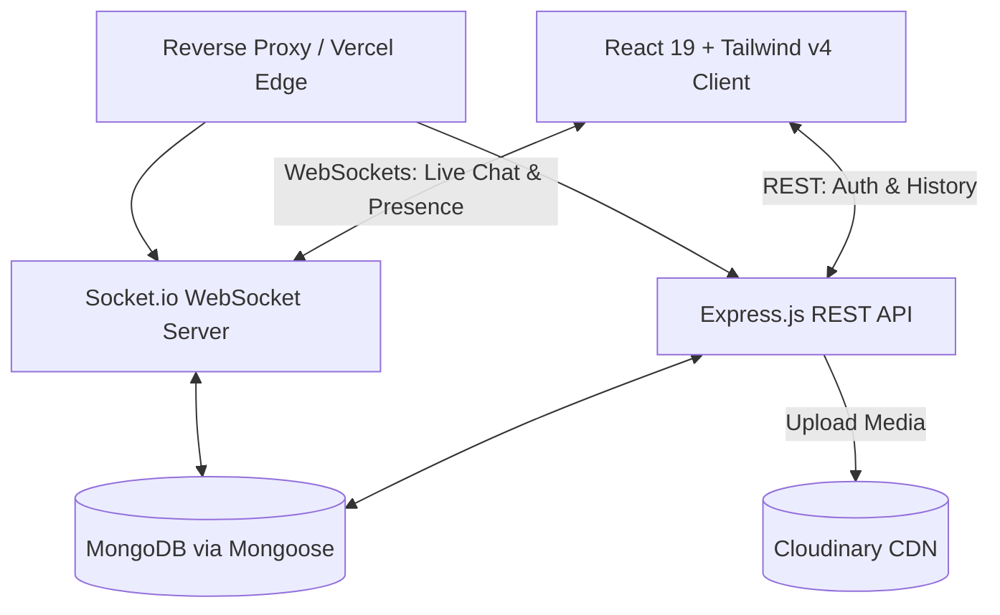

<div align="center">
  <!-- Animated Banner Placeholder -->
  

  <br />
  <br />

  <!-- Logo Placeholder -->
  

  <h1>💬 Modern Real-Time QuickChat</h1>

  <p>
    <b>Enterprise-grade, real-time messaging application with intelligent features, seamless file sharing, and dynamic user presence.</b>
  </p>

  <!-- Badges -->
  <p>
    
    
    
    
    
    <br/>
    
    
    
  </p>
  
  <p>
    <a href="#key-features">Features</a> •
    <a href="#why-this-project-matters">Why It Matters</a> •
    <a href="#architecture">Architecture</a> •
    <a href="#tech-ecosystem">Tech Stack</a> •
    <a href="#installation">Installation</a>
  </p>
</div>

---

## 🌟 Why This Project Matters

In today's remote-first and hyper-connected world, seamless communication is paramount. **QuickChat** represents a technical demonstration of how to build an enterprise-level messaging platform from the ground up, entirely free of PaaS lock-in (like Firebase or Supabase) for the core realtime messaging loop.

This project addresses the **complexity of maintaining real-time distributed state** by tightly integrating `Socket.io` with a reliable `Express` backend and a highly responsive `React 19` frontend. By effectively handling WebSockets alongside RESTful patterns for authentication and stateless operations, the application serves as a robust blueprint for startups or enterprises looking to embed reliable chat infrastructure into their own products. The design focuses heavily on **scalability**, **clean architecture**, and a **premium user experience**.

---

## ✨ Key Features & Product Showcase

Our feature set is designed to mimic top-tier SaaS messaging applications.

### 🔄 Real-Time Communication Engine
- **Instant Messaging**: Powered by Socket.io for bi-directional, low-latency communication.
- **Dynamic Online Presence**: Tracks and broadcasts connected users (`getOnlineUsers` event) natively.
- **Read Receipts Engine**: Smart database tracking for unseen messages and immediate "Mark as Seen" workflows.

### 🔐 Robust Authentication & Security
- **JWT-Based Auth**: Secure stateless authentication using HTTP-only standard tokens and bcrypt hashing.
- **Payload Limits**: Implemented strict 15MB request limits to prevent DDoS or overflow attacks.

### 🖼️ Rich Media & Profile Management
- **Cloudinary Integration**: Direct, secure image uploading and hosting for profile pictures and media messages.
- **Dynamic Avatars & Bios**: Full CRUD capability for user profiles and bios to enhance the social experience.

### 🎨 Premium UI/UX (Tailwind V4)
- **Fluid Layouts**: Utilizing the latest TailwindCSS v4 compiler for blazing-fast, responsive designs.
- **Interactive Feedback**: Using `react-hot-toast` for immediate, elegant user notifications upon actions.

<details>
<summary><b>📷 View Application Screenshots (Click to Expand)</b></summary>
<br/>

*Replace the placeholders below with actual project screenshots.*

| Login Screen | Main Chat Interface |
|:---:|:---:|
|  |  |
| *Clean, responsive login with form validation.* | *Sidebar user list, active chat, media uploading.* |

</details>

---

## 🏗️ Architecture & Technical Excellence

This project follows a strict separation of concerns, decoupling the Presentation Layer (React client) from the Business Logic and Data Access Layers (Node/Express Server).

### System Design Overview



### 💡 Engineering Highlights
1. **Hybrid Communication Model**: Uses REST APIs (`axios`) for heavy lifting (fetching message history, profile updates, auth) and reserves WebSockets (`socket.io`) exclusively for transient real-time events, optimizing server load.
2. **Efficient Connection Mapping**: Maintains a lightweight in-memory `userSocketMap` dictionary (`{userId: socketId}`) on the server to route private messages in O(1) time complexity.
3. **Concurrent Query Optimization**: Employs `Promise.all()` for simultaneous unread message counting across multiple sidebar users, dramatically reducing the API response time.

---

## 🛠️ Tech Ecosystem

The stack has been carefully selected to prioritize developer experience, performance, and community support.

| Category | Technology | Purpose |
|----------|------------|---------|
| **Frontend** | React (v19), Vite, React Router DOM | Core UI, fast dev compilation, SPA routing. |
| **Styling** | TailwindCSS (v4) | Utility-first, highly maintainable CSS framework. |
| **Backend** | Node.js, Express (v5) | High-performance, unopinionated web server. |
| **Real-Time** | Socket.io (v4.8) | Event-driven WebSocket abstraction and fallback. |
| **Database** | MongoDB, Mongoose | NoSQL flexible document storage and ODM schema validation. |
| **Storage** | Cloudinary | Dedicated Media CDN for images. |
| **Security** | bcryptjs, jsonwebtoken, cors | Password hashing, JWT auth, and Cross-Origin control. |

---

## 🚀 Installation & Local Development

Follow these steps to get the project running locally on your machine.

### Prerequisites
- Node.js (v18+ recommended)
- MongoDB Database (Local or MongoDB Atlas)
- Cloudinary Account (for image uploads)

### 1. Clone the repository
```bash
git clone https://github.com/SarthakDudhe/ChatApplication.git
cd ChatApplication
```

### 2. Backend Setup
```bash
cd server
npm install
```
Create a `.env` file in the `server` directory and configure the following:
```env
PORT=5000
MONGODB_URI=your_mongodb_connection_string
JWT_SECRET=your_super_secret_jwt_key
CLOUDINARY_CLOUD_NAME=your_cloud_name
CLOUDINARY_API_KEY=your_api_key
CLOUDINARY_API_SECRET=your_api_secret
NODE_ENV=development
```
Start the backend server:
```bash
npm run server
```

### 3. Frontend Setup
Open a new terminal window:
```bash
cd client/my-react-app
npm install
```
Start the Vite development server:
```bash
npm run dev
```
Your application will be available at `http://localhost:5173`.

---

## 📂 Folder Structure

```text
QuickChat/
├── client/                     # Frontend Application
│   └── my-react-app/           
│       ├── public/             # Static Assets
│       ├── src/                # React Source Code
│       ├── package.json        # Frontend dependencies
│       └── vite.config.js      # Vite configuration
└── server/                     # Backend Application
    ├── controllers/            # Business logic (messageController, userController)
    ├── lib/                    # Database configs and helpers
    ├── middleware/             # Auth guards and custom middleware
    ├── models/                 # Mongoose Schemas (User.js, Message.js)
    ├── routes/                 # Express API routing
    ├── server.js               # Application Entry Point & Socket config
    └── package.json            # Backend dependencies
```

---

## 🗺️ Roadmap & Future Enhancements

- [ ] **Typing Indicators**: Show when a user is actively typing a message.
- [ ] **Group Chats**: Expand the data model to support multi-user chat rooms.
- [ ] **Message Deletion/Editing**: Allow users to recall or edit recent messages.
- [ ] **End-to-End Encryption**: Implement client-side key generation for ultimate privacy.

---

## 🤝 Contribution Guidelines

Contributions are what make the open-source community such an amazing place to learn, inspire, and create. Any contributions you make are **greatly appreciated**.

1. Fork the Project
2. Create your Feature Branch (`git checkout -b feature/AmazingFeature`)
3. Commit your Changes (`git commit -m 'Add some AmazingFeature'`)
4. Push to the Branch (`git push origin feature/AmazingFeature`)
5. Open a Pull Request

---

## 📄 License

Distributed under the ISC License. See `package.json` for more information.

<div align="center">
  <b>Built with ❤️ by Sarthak Dudhe</b>
</div>
