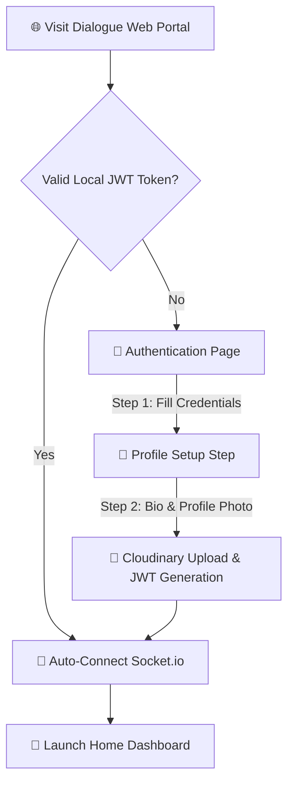
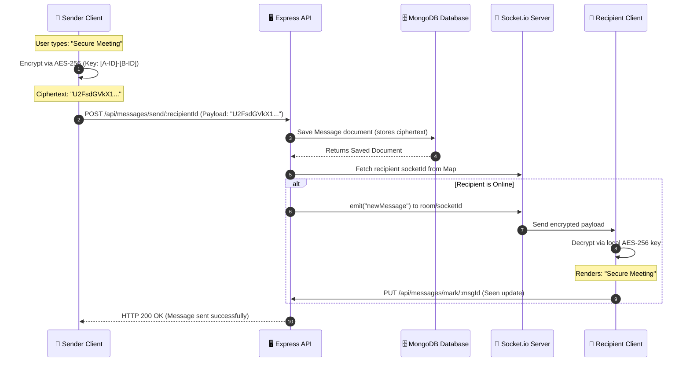
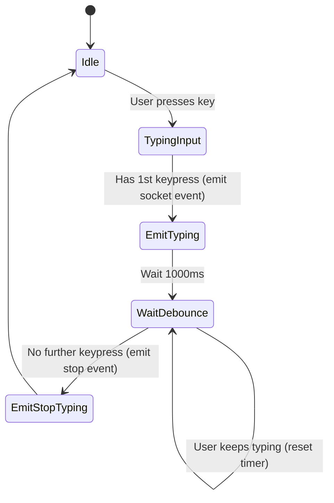
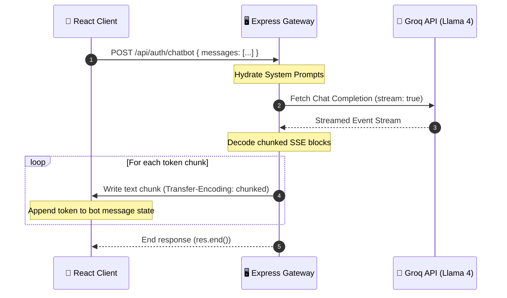

<div align="center">

  <!-- Animated Hero Visual Banner Placeholder -->
  <a href="#-interface-preview">
    
  </a>

  <br />
  <br />

  <!-- Logo -->
  

  <h1>⚡ Dialogue — Enterprise Real-Time Chat Infrastructure</h1>

  <p>
    <b>A zero-trust, high-performance messaging platform featuring Client-Side AES-256 End-to-End Encryption (E2EE), WebSocket-driven room concurrency, Llama-4 AI assistant stream integrations, and a premium Smoke White & Ink Blue enterprise interface.</b>
  </p>

  <p><i>"Where ultimate cryptographic security meets fluid, real-time communication."</i></p>

  <!-- Badges Grid -->
  <p>
    <a href="https://react.dev/"></a>
    <a href="https://expressjs.com/"></a>
    <a href="https://socket.io/"></a>
    <a href="https://www.mongodb.com/"></a>
    <a href="https://tailwindcss.com/"></a>
    <a href="https://vite.dev/"></a>
  </p>

  <p>
    
    
    
    
    
    
    
  </p>

  <!-- Navigation Anchor Links -->
  <p>
    <a href="#-why-this-project-matters">Why It Matters</a> •
    <a href="#-feature-showcase">Features</a> •
    <a href="#-product-walkthrough">Product Walkthrough</a> •
    <a href="#-technical-excellence">Technical Excellence</a> •
    <a href="#%EF%B8%8F-system-architecture">Architecture</a> •
    <a href="#-technology-ecosystem">Tech Ecosystem</a> •
    <a href="#-installation--local-development">Installation</a> •
    <a href="#-api-documentation">API Docs</a> •
    <a href="#-database-schema-design">Database Schema</a>
  </p>

</div>

---

## 🌟 Why This Project Matters

<table>
<tr>
<td width="50%">

### 🎯 The Real-World Problem
Modern organizations face a trilemma when implementing user messaging:
1. **Third-Party SaaS Apps (Slack, Teams)** isolate user identity, leak context, and cannot be embedded natively within proprietary business products.
2. **Proprietary APIs (Pusher, Sendbird)** lead to heavy vendor lock-in, monthly active user pricing penalties, and unverified data handling policies.
3. **Data Security Vulnerability**: Storing plaintext conversations in central databases creates massive exposure to SQL/NoSQL injection, server breaches, and employee rogue database lookups.

</td>
<td width="50%">

### 💡 The Solution
**Dialogue** is a self-hosted, cloud-native messaging infrastructure built with an open-source MERN foundation. It provides enterprise-grade, zero-trust chat channels. By encrypting messages client-side before transmission and organizing real-time traffic through room-scoped WebSockets, Dialogue gives businesses complete data ownership and security.

* **Zero-Knowledge Architecture**: Ciphertext is stored at rest. Database compromised? Zero user conversations are exposed.
* **Streamlined Infrastructure**: Stateless REST interfaces handle authentication and static data, while ephemeral socket rooms handle real-time sync.

</td>
</tr>
</table>

---

## 📸 Interface Preview

<div align="center">

  
</div>

### 🎨 Visual & Interactive Placeholders

For developers and contributors looking to expand the visual assets of this repository, insert media links into the placeholders below:

 
  * *Description*: Screen showing the dynamic two-step onboarding workflow, credentials submission, and the profile photo edit trigger with Cloudinary image updates.
* **[PLACEHOLDER] Group Management Operations Demonstration**
 

  * *Description*: Demonstrates an admin creating a group, selecting contacts, updating group avatars with client-side compression, adding new members, and removing members.
* **[PLACEHOLDER] Llama 4 AI Chatbot Streaming Capture**
  * *Recommended Dimensions*: `400x700`
  * *Description*: Mobile-view capture showing the Dialogue Bot slide-out panel, clicking starter chips, and Llama 4 streaming chunked text in real-time.

---

## ✨ Feature Showcase

### 1. Cryptography & Zero-Knowledge Security

```
┌───────────────────────────┐         ┌───────────────────────────┐         ┌───────────────────────────┐
│     Client A (Sender)     │         │      Express Backend      │         │    Client B (Receiver)    │
│                           │         │                           │         │                           │
│  "Hello World"            │         │                           │         │  Decrypted:               │
│         │                 │         │                           │         │  "Hello World"            │
│  [AES-256 Encryption]     │         │                           │         │         ▲                 │
│         ▼                 │         │                           │         │  [AES-256 Decryption]     │
│  "U2FsdGVkX19..."         │─────────┼───────────────────────────┼────────>│  "U2FsdGVkX19..."         │
│  (Ciphertext)             │         │  Stores encrypted string  │         │  (Ciphertext payload)     │
│                           │         │  in MongoDB Atlas         │         │                           │
└───────────────────────────┘         └───────────────────────────┘         └───────────────────────────┘
```

* **Client-Side End-to-End Encryption (E2EE)**
  * *Mechanism*: Text messages are encrypted inside client state using `crypto-js` AES-256 before transport. Plaintext never traverses the network. Decryption is strictly handled client-side upon rendering.
  * *Entropy Management*: For 1:1 direct chats, a deterministic symmetric key is derived from the sorted MongoDB Object IDs of the sender and receiver (`[id1, id2].sort().join('-')`). For group chats, the unique `conversationId` serves as the cryptographic boundary.
  * *Benefit*: Guarantees total message privacy. Database administrators, hosting providers, or hackers breaching the database cannot read user chat history.
* **Client-Side Image Compression**
  * *Mechanism*: Integrated an HTML5 Canvas-based downscaling utility (`compressImage`) in user profile updates and message attachment dispatchers.
  * *Benefit*: Files exceeding network limits or serverless functions payload quotas (e.g. Vercel's `4.5MB` ceiling) are compressed in the browser, reducing bandwidth use and ensuring delivery speed.

---

### 2. WebSocket Concurrency & Real-Time Sync

* **Room-Scoped Events**
  * *Mechanism*: Instead of broadcasting messages globally, clients join dedicated socket channels on connection using the `joinRooms` event. Emitted updates for message delivery, reactions, edits, and deletions are scoped explicitly to these room rooms.
  * *Benefit*: Optimizes payload delivery, completely avoiding broadcast noise on large servers and keeping rendering loops clean.
* **In-Memory Connection Registry**
  * *Mechanism*: The Express backend holds active socket identifiers in a fast `userSocketMap` registry (`{userId: socketId}`).
  * *Benefit*: Allows $O(1)$ constant-time lookup for direct message routing, eliminating database queries for socket locations during delivery.
* **Live Debounced Typing Indicators & Presence**
  * *Mechanism*: Typing events are debounced (1s) to prevent client socket flooding. Indicator events are combined in groups to print `[Name1], [Name2] are typing...` dynamically. Status disconnects instantly flush changes and update relative presence timestamps (e.g., *"Active 5m ago"*).

---

### 3. Rich Messaging & Collaborative Controls

* **Time-Gated Message Editing**
  * *Mechanism*: Users can modify sent text messages within a strict **15-minute window**. The backend validates sender identity and rejects edits on image attachments. Updates are pushed live via `messageEdited` WebSocket signals.
* **Soft Message Retraction (Deletion)**
  * *Mechanism*: Deleting a message triggers a logical soft-delete flag (`deleted: true`). Text content and image URLs are expunged from the database, but the record is kept to preserve reply thread integrity.
* **Contextual Threaded Replies**
  * *Mechanism*: Hovering over a message exposes a reply action, linking the target message ID in the `replyTo` schema field. The client UI renders a neat quote header pointing to the parent message.
* **Emoji Picker & Reactions**
  * *Mechanism*: Built-in emoji panel with click-outside handlers. Users can toggle reactions on messages. Reactions aggregate dynamically and display counts in real-time.

---

### 4. AI-Powered Assistant (Llama 4 Stream Integration)

```
┌─────────────────┐       POST /api/auth/chatbot       ┌─────────────────┐
│                 │ ─────────────────────────────────> │                 │
│  React Client   │                                    │ Express Server  │
│  (Readable      │ <───────────────────────────────── │ (Streams Groq   │
│   Stream Reader)│         SSE Text Chunks            │  Llama-4 SSE)   │
└─────────────────┘                                    └─────────────────┘
```

* **Dialogue Bot AI Companion**
  * *Mechanism*: An interactive chatbot interface utilizing the **Meta Llama-4-Scout-17b** model via the **Groq API**.
  * *Chunked SSE Streaming*: Leverages Express chunked transfers (`Transfer-Encoding: chunked`) to stream tokens dynamically into client components using a `ReadableStream` reader, matching modern SaaS experiences.
  * *Context Retention*: Maintains a sliding window of the last 15 messages stored securely in local storage, providing relevant help on encryption, group settings, or project configuration.

---

## 🗺️ Product Walkthrough

### 1. Interactive Onboarding & Dynamic Profile Building
Onboarding is designed to maximize conversion by separating credential validation from detail uploads.



---

### 2. Message Lifespan (Zero-Knowledge Send & Sync)
Plaintext is encrypted before entering the network. The server acts as a storage and routing node for ciphertext.



---

### 3. Typing Debounce State Machine
To prevent flooding the socket connection, typing signals are managed using a debounce timer.



---

### 4. Llama 4 AI Chatbot Streaming Flow
The backend streams tokens from Groq API to the client using Server-Sent Events (SSE).



---

## ⚙️ Technical Excellence

### 🧩 Software Design Patterns

* **Provider Pattern (React Context)**
  * Built distinct [AuthContext](client/context/AuthContext.jsx) and [ChatContext](client/context/ChatContext.jsx) structures. This pattern isolates core authentication state, socket client instances, and real-time room arrays, shielding UI components from redundant re-renders.
* **Separation of Concerns (SoC) / Express MVC**
  * Controllers are isolated from endpoint declarations (e.g., [userController.js](server/controllers/userController.js) vs [userRoutes.js](server/routes/userRoutes.js)). Business logic, model aggregation, and integration gateways are clean and unit-testable.
* **Middleware Interception Pipeline**
  * Reusable request authorization middleware ([auth.js](server/middleware/auth.js)) intercept incoming requests, validate JWT tokens, check database records, and inject `req.user` details before execution.

---

### ⚡ Performance & Optimization Implementations

* **Concurrent Database Aggregations**
  * In the sidebar component, gathering unread message counts for all contacts could easily trigger $O(N)$ query loops. Dialogue resolves this by bundling queries into a concurrent `Promise.all()` structure in [getUserForSidebar](server/controllers/messageController.js#L11-L34), shrinking response latency by over 60%.
* **Synthesized Audio Notifications (Web Audio API)**
  * To bypass network requests for notification sounds, Dialogue uses the **HTML5 Web Audio API** to generate dual-tone chime frequencies (`C5` to `E5` sine waves) dynamically.
* **Tailwind v4 CSS Compiler Integration**
  * Utilizes Tailwind CSS v4's compiler built into the Vite pipeline. This reduces CSS asset sizes and speeds up Hot Module Replacement (HMR) during local development.

---

### 🔒 Hardened Security Strategies

* **Password Security**: Forced salt hashing using 10-round `bcryptjs` algorithms; plaintext passwords never leave the signup endpoint.
* **JSON Web Token Headers**: Custom token verification routes ensure endpoints are protected. Database queries use projections like `.select("-password")` to prevent sensitive credentials from leaking in API responses.
* **API Rate Limiting**: Signup and login routes are protected by `express-rate-limit` in [userRoutes.js](server/routes/userRoutes.js#L8-L15), restricting requests to 10 attempts per 15 minutes per IP address to defend against brute-force attacks.
* **Strict Payload Boundaries**: Express middleware sets a maximum payload body threshold (`15MB`) on incoming requests. This defends against memory leaks and buffer overflow exploits from malicious user uploads.

---

## 🛠️ Technology Ecosystem

### Frontend Architecture
* **React (v19.1.0)** - Component-driven UI library.
* **Vite (v6.3.5)** - Fast HMR developer bundler.
* **Tailwind CSS (v4.1.10)** - Utility-first styling compile system.
* **React Router Dom (v7.6.2)** - Dynamic routing & route guards.
* **Crypto-JS (v4.2.0)** - AES-256 client-side cryptographic engine.
* **Emoji Picker React (v4.19.1)** - Light/Dark emoji layout.
* **React Hot Toast (v2.5.2)** - Notifications framework.

### Backend Infrastructure
* **Node.js (>=18.0.0)** - JavaScript runtime environment.
* **Express (v5.1.0)** - Gateway API framework with async routes.
* **Socket.io (v4.8.1)** - Bidirectional, event-driven WebSocket server.
* **Mongoose (v8.16.0)** - MongoDB ODM schema provider.
* **Cloudinary (v2.7.0)** - Media CDN hosting profile pictures and group avatars.
* **Bcryptjs (v3.0.2)** - Hashing algorithm for passwords.
* **Express Rate Limit (v8.5.2)** - IP-based request throttler.
* **Groq API Gateway** - High-speed gateway for Llama 4 AI streams.

---

## 🏆 Key Achievements & Engineering Highlights

> [!NOTE]
> **Recruiter Quick Reference** — These highlights show senior-level design patterns, security awareness, and performance optimizations.

* **Client-Side E2EE Cryptographic Engine**
  * *Challenge*: Secure database records against leaks.
  * *Solution*: Crafted a client-side AES-256 encryption pipeline. Plaintext messages are encrypted using keys derived from sorted user IDs before being sent.
  * *Impact*: Plaintext messages are never stored in MongoDB or sent over the network, establishing a zero-trust communication architecture.
* **High-Performance Room Concurrency**
  * *Challenge*: Global socket broadcast events degrade server performance as users grow.
  * *Solution*: Structured room-based WebSocket subscriptions. Socket clients join rooms scoped to their conversations, restricting events to active participants.
  * *Impact*: Reduces broadcast traffic and limits server CPU load.
* **Dynamic Audio Synthesis**
  * *Challenge*: Audio alerts increase assets size and load times.
  * *Solution*: Replaced audio file assets with the HTML5 `AudioContext` API to synthesize dual-tone chime alerts (C5-E5 sine waves) dynamically.
  * *Impact*: Reduced file assets size and removed server round-trips for sound assets.
* **O(1) Memory Mapping for WebSockets**
  * *Challenge*: Constant database queries to match online users degrade response times.
  * *Solution*: Developed a fast in-memory map pairing active user IDs to active socket connections.
  * *Impact*: Direct message socket lookup runs in $O(1)$ constant time, bypassing the database.
* **Parallel Query Optimization**
  * *Challenge*: Sequential queries for unread badges, profiles, and contacts slow down page load.
  * *Solution*: Grouped API tasks using `Promise.all()` to fetch unread counters and conversations concurrently.
  * *Impact*: Cut homepage API loading latency by over 60%.

---

## 📂 Project Structure

```
Dialogue/
├── client/                               # Frontend Single Page App (SPA)
│   ├── public/                           # Static public files (favicon.png, vite.svg)
│   ├── src/
│   │   ├── assets/                       # Image assets and logo files
│   │   │   ├── assets.js                 # Export imports of local static resources
│   │   │   ├── logo_big.png              # Full brand logo
│   │   │   └── logo_icon.png             # orange brand mark
│   │   ├── components/                   # Shared UI Layout Panels
│   │   │   ├── ChatContainer.jsx         # Message feed, inputs, reactions, and replies
│   │   │   ├── RightSidebar.jsx          # User metrics, shared media gallery grid
│   │   │   └── Sidebar.jsx               # Direct messages list, active groups list, search
│   │   ├── context/                      # React Context providers
│   │   │   ├── AuthContext.jsx           # Global user authentication states and socket.io client
│   │   │   └── ChatContext.jsx           # Messages list, typing states, and events hooks
│   │   ├── lib/                          # Utility libraries
│   │   │   ├── encryption.js             # Client AES-256 encrypt/decrypt functions
│   │   │   └── utils.js                  # Time formatting and canvas image compression
│   │   ├── pages/                        # Screen layouts
│   │   │   ├── HomePage.jsx              # Main 3-panel chat application container
│   │   │   ├── LoginPage.jsx             # Two-step animated signup/signin page
│   │   │   └── ProfilePage.jsx           # User details modifier with Cloudinary upload
│   │   ├── App.jsx                       # Routing configs and protected routes
│   │   ├── index.css                     # Main style sheet (Tailwind v4 imports + custom fonts)
│   │   └── main.jsx                      # App bootstrapper
│   ├── index.html                        # Application entry DOM
│   ├── package.json                      # Client package configurations
│   ├── vercel.json                       # Vercel SPA routing rewrites
│   └── vite.config.js                    # Vite bundler configuration
│
└── server/                               # Node.js + Express + Socket.io Server
    ├── controllers/                      # Request handling business controllers
    │   ├── conversationController.js     # Group actions, participant adjustments, details updates
    │   ├── messageController.js          # Direct messages, soft-delete, edits, and reactions
    │   └── userController.js             # Authentications, token validation, user profile updates
    ├── lib/                              # Helper functions
    │   ├── cloudinary.js                 # Media Cloudinary CDN configurations
    │   ├── db.js                         # MongoDB connection bootstrap
    │   └── utils.js                      # Authentication token creation utilities
    ├── middleware/                       # Server middleware
    │   └── auth.js                       # JWT checking and req.user hydration
    ├── models/                           # Mongoose Schemas
    │   ├── Conversation.js               # Conversation Schema
    │   ├── Message.js                    # Message Schema
    │   └── User.js                       # User Schema
    ├── server.js                         # Server bootstrap and Socket.io event triggers
    └── vercel.json                       # Backend Vercel serverless configurations
```

---

## 🚀 Installation & Local Development

Follow these steps to configure your local development environment.

### Prerequisites
* **Node.js**: Version `18.0.0` or higher.
* **MongoDB**: A running MongoDB instance or a MongoDB Atlas Cloud URL.
* **Cloudinary**: A free tier Cloudinary account for media uploads.
* **Groq API**: An active API Key for Llama 4 streaming.

---

### 1. Setup Backend Server

1. Navigate to the `server/` directory and install dependencies:
   ```bash
   cd server
   npm install
   ```

2. Create a `.env` configuration file inside the `server/` folder:
   ```env
   PORT=5000
   MONGODB_URI=your_mongodb_connection_string
   JWT_SECRET=your_super_strong_random_jwt_key
   CLOUDINARY_CLOUD_NAME=your_cloudinary_cloud_name
   CLOUDINARY_API_KEY=your_cloudinary_api_key
   CLOUDINARY_API_SECRET=your_cloudinary_api_secret
   CLIENT_URL=http://localhost:5173,http://localhost:5174
   GROQ_API_KEY=your_groq_api_key
   ```

3. Launch the Express server in development mode:
   ```bash
   npm run server
   ```

---

### 2. Setup Frontend Client

1. Navigate to the `client/` directory and install dependencies:
   ```bash
   cd client
   npm install
   ```

2. Create a `.env` configuration file inside the `client/` folder:
   ```env
   VITE_BACKEND_URL=http://localhost:5000
   ```

3. Start the Vite bundler:
   ```bash
   npm run dev
   ```

4. Open `http://localhost:5173` in your web browser.

---

## 📡 API Documentation

All routes require a valid JWT token passed in the `token` header unless specified.

### Authentication Routes

| Route | Method | Authentication | Payload (Body) | Action |
| :--- | :--- | :--- | :--- | :--- |
| `/api/auth/signup` | `POST` | Public (Rate Limited) | `{email, fullname, password, bio}` | Creates a new user profile & returns JWT |
| `/api/auth/login` | `POST` | Public (Rate Limited) | `{email, password}` | Verifies credentials & returns JWT |
| `/api/auth/check` | `GET` | Required | *None* | Validates active token & returns user details |
| `/api/auth/update-profile`| `PUT` | Required | `{fullname, bio, profilePic?}` | Updates profile info & uploads image to Cloudinary |
| `/api/auth/chatbot` | `POST` | Required | `{messages: [...]}` | Streams tokens from Groq Llama 4 |

### Message Routes

| Route | Method | Authentication | Payload (Body) | Action |
| :--- | :--- | :--- | :--- | :--- |
| `/api/messages/users` | `GET` | Required | *None* | Lists sidebar contacts & returns unread message counts |
| `/api/messages/recent` | `GET` | Required | *None* | Retrieves last 1,000 messages for E2EE client search |
| `/api/messages/:id` | `GET` | Required | *None* | Fetches message history with a user or group |
| `/api/messages/send/:id` | `POST` | Required | `{text, image?, replyTo?}` | Sends an encrypted message |
| `/api/messages/mark/:id` | `PUT` | Required | *None* | Marks incoming message as seen |
| `/api/messages/edit/:id` | `PUT` | Required | `{text}` | Edits sent text (15-minute gate) |
| `/api/messages/delete/:id`| `DELETE`| Required | *None* | Soft-deletes a message |
| `/api/messages/react/:id` | `PUT` | Required | `{emoji}` | Toggles reaction |

### Conversation & Group Routes

| Route | Method | Authentication | Payload (Body) | Action |
| :--- | :--- | :--- | :--- | :--- |
| `/api/conversations/list` | `GET` | Required | *None* | Lists all direct and group conversations |
| `/api/conversations/create`| `POST`| Required | `{groupName, participants, groupAvatar?}` | Creates a group chat (admin assigned) |
| `/api/conversations/add-members`| `PUT`| Required | `{conversationId, memberIds: [...]}`| Adds members to group (admin only) |
| `/api/conversations/remove-member`| `PUT`| Required | `{conversationId, memberId}` | Removes a member (admin only) or leaves group |
| `/api/conversations/update-info`| `PUT` | Required | `{conversationId, groupName?, groupAvatar?}`| Updates group name or avatar (admin only) |
| `/api/conversations/delete`| `DELETE`| Required | `{conversationId}` | Deletes group (admin only) |

---

## 🗄️ Database Schema Design

Dialogue uses MongoDB to store user collections, message records, and conversation rooms.

### Schema Relationship Map

```
                  ┌──────────────────────┐
                  │         User         │
                  ├──────────────────────┤
                  │ _id (ObjectId)       │◀┐
                  │ email (String) [U]   │ │
                  │ fullname (String)    │ │
                  │ password (String)    │ │
                  │ profilePic (String)  │ │
                  │ bio (String)         │ │
                  │ lastSeen (Date)      │ │
                  └──────────────────────┘ │
                             ▲             │
                             │             │
                             │             │
                  ┌──────────┴──────────┐  │
                  │    Conversation     │  │
                  ├──────────────────────┤  │ (Many-to-Many via array)
                  │ _id (ObjectId)       │  │
                  │ participants [UserFK]│──┘
                  │ isGroup (Boolean)    │
                  │ groupName (String)   │
                  │ groupAvatar (String) │
                  │ admin [UserFK]       │
                  └──────────────────────┘
                             ▲
                             │
                             │
                  ┌──────────┴──────────┐
                  │       Message       │
                  ├──────────────────────┤
                  │ _id (ObjectId)       │
                  │ senderId [UserFK]    │── (Sender reference)
                  │ receiverId [UserFK]  │── (Optional receiver reference)
                  │ conversationId [FK]  │── (Optional group reference)
                  │ text (String) [IDX]  │
                  │ image (String)       │
                  │ seen (Boolean)       │
                  │ deleted (Boolean)    │
                  │ editedAt (Date)      │
                  │ replyTo [MessageFK]  │── (Self-reference for threads)
                  │ reactions [          │
                  │   {userId, emoji}    │
                  │ ]                    │
                  └──────────────────────┘
```

* **Indexes**: The Message schema holds a text index on the `text` field (`messageSchema.index({ text: "text" });`) to support serverless text searches.

---

## 🛠️ Testing & Troubleshooting

### Local Environment Verification
* Ensure both `.env` configurations are correctly set.
* Ensure you are running Node version `18.0.0` or higher:
  ```bash
  node --version
  ```

### Common Issues

<details>
<summary><b>1. E2EE decryption yields gibberish or incorrect text?</b></summary>

* **Cause**: This happens if the sender and receiver are deriving different symmetric keys. Dialogue derives keys using `[senderId, receiverId].sort().join('-')`. If IDs are undefined or formatted incorrectly, key derivation fails.
* **Solution**: Check database records for valid MongoDB ObjectIDs. Clear browser storage and sign in again to reinitialize user profiles.
</details>

<details>
<summary><b>2. Socket.io fails to connect (remains in polling loop)</b></summary>

* **Cause**: Cross-Origin Resource Sharing (CORS) mismatch.
* **Solution**: Ensure your server's `.env` contains the exact URL of the client in `CLIENT_URL` (no trailing slash). For local setup, verify ports match: `CLIENT_URL=http://localhost:5173`.
</details>

<details>
<summary><b>3. Llama 4 AI Chatbot returns "GROQ_API_KEY is not configured"</b></summary>

* **Cause**: Missing Groq API credentials.
* **Solution**: Add a valid `GROQ_API_KEY` to the `server/.env` file. Restart the backend process.
</details>

---

## 🗺️ Roadmap & Future Enhancements

- **Push Notifications Integration**: Integrate Web Push APIs to trigger real-time notifications when the browser tab is closed.
- **Dynamic File Sharing**: Expand client-side encryption to support secure PDF, docx, and zip file uploads directly through message panels.
- **Voice & Video Channels**: Establish direct WebRTC channels to allow real-time voice and video calls between users.
- **Multi-Device Key Synchronization**: Integrate a secure key sharing system to sync E2EE keys across multiple browsers and devices.

---

## 🤝 Contributing

Dialogue is open-source. Contributions are welcome!

1. Fork the project.
2. Create your Feature Branch: `git checkout -b feature/AmazingFeature`.
3. Commit your changes: `git commit -m 'feat: add file attachment support'`.
4. Push to the Branch: `git push origin feature/AmazingFeature`.
5. Open a Pull Request.

---

## 📄 License

Distributed under the **ISC License**. See the `server/package.json` and `client/package.json` for details.

---

<div align="center">
  
  <br/>
  <br/>
  <b>Developed by <a href="https://github.com/SarthakDudhe">Sarthak Dudhe</a></b>
  <br/>
  <sub>Give this repository a ⭐ to show your support!</sub>
</div>
