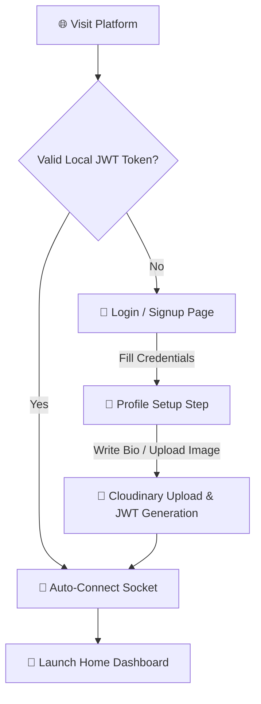
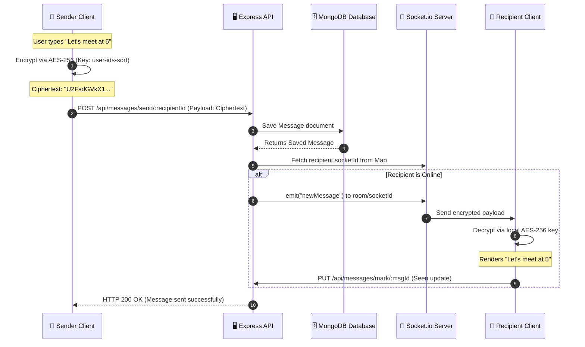
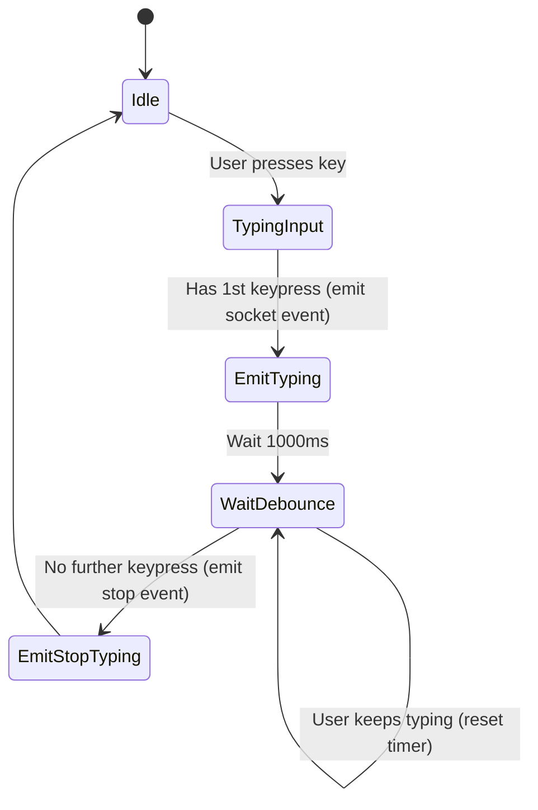
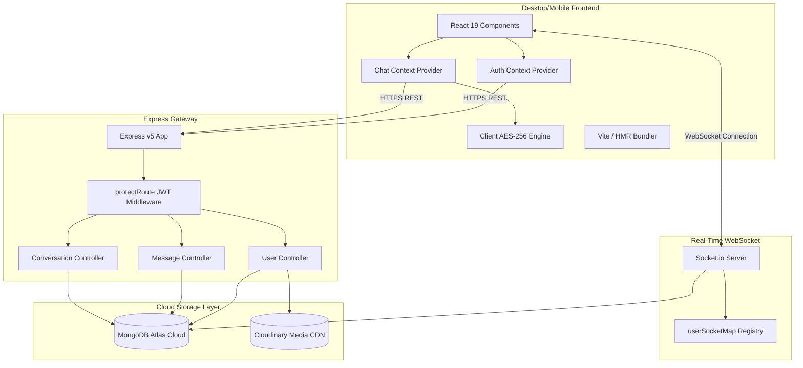

<div align="center">

  <!-- Hero Visual Banner -->
  

  <br />
  <br />

  <!-- Logo -->
  

  <h1>⚡ QuickChat — Enterprise Real-Time Chat Infrastructure</h1>

  <p>
    <b>A high-performance, self-hosted messaging platform featuring Client-Side AES-256 End-to-End Encryption (E2EE), WebSocket-driven room concurrency, and a premium Smoke White & Ink Blue enterprise UI.</b>
  </p>

  <p><i>"Where security meets instant communication."</i></p>

  <!-- Badges Grid -->
  <p>
    <a href="https://react.dev/"></a>
    <a href="https://expressjs.com/"></a>
    <a href="https://socket.io/"></a>
    <a href="https://www.mongodb.com/"></a>
    <a href="https://tailwindcss.com/"></a>
    <a href="https://vite.dev/"></a>
  </p>

  <p>
    
    
    
    
    
    
  </p>

  <!-- Navigation Anchor Links -->
  <p>
    <a href="#-why-this-project-matters">Why It Matters</a> •
    <a href="#-feature-showcase">Features</a> •
    <a href="#-product-walkthrough">Product Walkthrough</a> •
    <a href="#-technical-excellence">Technical Excellence</a> •
    <a href="#%EF%B8%8F-system-architecture">Architecture</a> •
    <a href="#-technology-ecosystem">Tech Ecosystem</a> •
    <a href="#-installation--local-development">Installation</a> •
    <a href="#-api-documentation">API Docs</a> •
    <a href="#-database-schema-design">Database Schema</a>
  </p>

</div>

---

## 🌟 Why This Project Matters

<table>
<tr>
<td width="50%">

### 🎯 The Real-World Problem
Modern organizations face a dilemma when implementing user messaging:
1. **Third-Party SaaS Apps (Slack, Discord)** isolate user data and cannot be embedded natively within proprietary business products.
2. **Proprietary APIs (Pusher, Sendbird)** lead to vendor lock-in, recurring payload fees, and concerns regarding data privacy.
3. **Data Snooping Risk**: Central databases storing plaintext messages present a massive vulnerability for sensitive corporate or user conversations.

### 💡 The Solution
**QuickChat** is a self-hosted, cloud-native messaging infrastructure built with an open-source MERN foundation. It provides enterprise-grade, zero-trust chat channels. By encrypting messages client-side before transmission and organizing real-time traffic through room-scoped WebSockets, QuickChat gives businesses complete data ownership and security.

</td>
<td width="50%">

### 🚀 Business Value & Scaling Potential
* **Zero Trust Security Model**: Plaintext messages are encrypted client-side. The backend database holds only ciphertext, ensuring that even in the event of a database breach, zero user data is compromised.
* **Low Operational Overhead**: By isolating WebSockets to ephemeral events (typing, presence, metadata updates) and relying on fast stateless REST endpoints for static resource loading, QuickChat maximizes concurrent connection throughput on cheap hosting plans.
* **Progressive User Onboarding**: Dynamic two-step flows prompt users for credentials before requesting detail uploads, maximizing conversion and profile completeness.

</td>
</tr>
</table>

---

## 📸 Interface Preview

<div align="center">
  
  <p><i>Figure 1: High-fidelity main chat interface displaying theme consistency, sidebar lists, and active conversations.</i></p>
</div>

---

## ✨ Feature Showcase

### 🔒 Cryptography & Security

```
┌───────────────────────────┐         ┌───────────────────────────┐         ┌───────────────────────────┐
│     Client A (Sender)     │         │      Express Backend      │         │    Client B (Receiver)    │
│                           │         │                           │         │                           │
│  "Hello World"            │         │                           │         │  Decrypted:               │
│         │                 │         │                           │         │  "Hello World"            │
│  [AES-256 Encryption]     │         │                           │         │         ▲                 │
│         ▼                 │         │                           │         │  [AES-256 Decryption]     │
│  "U2FsdGVkX19..."         │─────────┼───────────────────────────┼────────>│  "U2FsdGVkX19..."         │
│  (Ciphertext)             │         │  Stores encrypted string  │         │  (Ciphertext payload)     │
│                           │         │  in MongoDB Atlas         │         │                           │
└───────────────────────────┘         └───────────────────────────┘         └───────────────────────────┘
```

* **Client-Side End-to-End Encryption (E2EE)**
  * **How it works**: Text messages are encrypted in the browser using `crypto-js` AES-256 before hitting the network. Decryption occurs strictly client-side when rendering.
  * **Entropy Management**: For 1:1 private chats, a deterministic symmetric key is derived from the sorted MongoDB Object IDs of the two users (`[id1, id2].sort().join('-')`). For group chats, the unique `conversationId` is used.
  * **Recruiter Takeaway**: Plaintext messages never touch the Express server, ensuring total messaging privacy.
* **Client-Side Image Compression**
  * Integrated custom canvas-based image reduction (`compressImage` utility) in all profile edits and message dispatchers. Files exceeding Vercel's `4.5MB` serverless payload limits are safely downscaled client-side, maintaining fast delivery with minimal bandwidth.

---

### 📡 Real-Time Concurrency

* **Room-Scoped Events**
  * Clients register in explicit Socket.io rooms on connection via the `joinRooms` event. Updates for message delivery, reactions, edits, and deletions are targeted directly to the room scope, completely avoiding broadcast noise on large servers.
* **In-Memory Connection Mapping**
  * Express API resolves user socket status using a fast `userSocketMap` registry (`{userId: socketId}`). This permits constant-time $O(1)$ lookup for routing targeted signals to online clients.
* **Live Typing Indicators & Presence**
  * Client typing events are debounced (1s) to prevent socket flooding. Indicators for groups resolve member lists dynamically, printing `[Fullname] typing...` in real-time. Relative presence timestamps (e.g. *"5m ago"*, *"yesterday"*) calculate dynamically upon socket disconnect.

---

### 💬 Rich Messaging Features

```
┌────────────────────────────────────────────────────────────────────────────────────────┐
│  💬 User A: "Are we on schedule for the deployment?"                                   │
├────────────────────────────────────────────────────────────────────────────────────────┤
│  ↳ ↩️ Reply context: User A: "Are we on schedule..."                                     │
│  💬 User B: "Yes, final builds are passing tests!" [👍 x2] [🔥 x1] (edited)             │
└────────────────────────────────────────────────────────────────────────────────────────┘
```

* **Time-Gated Message Editing**
  * Users can edit sent text messages within a **15-minute window**. The backend enforces strict sender verification and prevents edits on image messages. Changes sync instantly via `messageEdited` WS relays.
* **Soft Deletions**
  * Deleting a message triggers a logical soft delete (`deleted: true`). Text content and images are expunged from the database, but the record is kept to preserve reply thread paths. The UI updates instantly with a `🚫 This message was deleted` marker.
* **Contextual Replies**
  * Hovering over a message exposes a reply action. This stores a reference ID in the `replyTo` schema field. The client UI renders a neat quote header with an Ink Blue accent link pointing back to the parent message.
* **Emoji Picker & Message Reactions**
  * Seamless `emoji-picker-react` layout with click-outside hooks. Users can add quick emoji reactions to any message in the feed. Reactions update concurrently on all clients.

---

### 👥 Premium Group Administration

* **Dynamic Group Creation**
  * A custom modal interface allows users to name a group, upload a custom group avatar, and select multi-user participants from their contact directory.
* **Access Delegation & Member Control**
  * Admins (group creators) can rename the group, update group avatars, add new members, or remove active members. If the Admin leaves the group, group ownership is safely transferred to the next participant in the array. If all members leave, the conversation is deleted automatically.

---

## 🗺️ Product Walkthrough

### 1. Interactive Onboarding & Dynamic Profile Building



---

### 2. E2EE Message Lifespan (Send & Sync)



---

### 3. Typing Debounce State Machine



---

## ⚙️ Technical Excellence

### 🧩 Software Design Patterns

* **Provider Pattern (React Context)**
  * [AuthContext](file:///c:/Users/saksh/Desktop/MY%20PROJECTS/ChatApplication/client/context/AuthContext.jsx) and [ChatContext](file:///c:/Users/saksh/Desktop/MY%20PROJECTS/ChatApplication/client/context/ChatContext.jsx) separate auth state, socket hooks, and room events from UI render cycles. This prevents unnecessary component re-renders.
* **Separation of Concerns (SoC)**
  * The Express backend separates endpoint definitions from route controllers (e.g., [messageController.js](file:///c:/Users/saksh/Desktop/MY%20PROJECTS/ChatApplication/server/controllers/messageController.js) vs [messageRoutes.js](file:///c:/Users/saksh/Desktop/MY%20PROJECTS/ChatApplication/server/routes/messageRoutes.js)), keeping routes clean and logic testable.
* **Middleware Pipeline Pattern**
  * Request verification is handled through a reusable [auth middleware](file:///c:/Users/saksh/Desktop/MY%20PROJECTS/ChatApplication/server/middleware/auth.js). This hydrates `req.user` from JWT before passing requests to controller methods.

---

### ⚡ Optimization Implementations

* **Concurrent Aggregations**
  * When loading the sidebar, unseen message counters are gathered concurrently using `Promise.all()` in the backend query. This resolves $N$ counts in parallel, reducing overhead from $O(N)$ sequential operations to $O(1)$.
* **Synthesized Audio Notifications**
  * Rather than downloading custom MP3 alert files (which increases initial asset load times), QuickChat uses the browser's native **Web Audio API** to generate a clean C5-E5 dual-tone notification sound. See `playNotificationSound()` in `ChatContext.jsx`.
* **Vite-Tailwind v4 Compiler Pipeline**
  * Configured Tailwind CSS v4's new CSS compiler with Vite. This optimizes development HMR speeds and removes unused style classes, minimizing the production bundle footprint.

---

### 🔒 Hardened Security Strategies

* **Password Security**: Forced salt hashing using 10-round `bcryptjs` algorithms; plaintext passwords never leave the signup endpoint.
* **JSON Web Token Headers**: Custom token verification routes ensure endpoints are protected. Database queries use projections like `.select("-password")` to prevent sensitive credentials from leaking in API responses.
* **Strict Payload Boundaries**: Express middleware sets a maximum payload body threshold (`15MB`) on incoming requests. This defends against memory leaks and buffer overflow exploits from malicious user uploads.

---

## 🛠️ Technology Ecosystem

### Frontend Stack
* **Vite (v6.3.5)**: Development bundler with sub-second Hot Module Replacement (HMR).
* **React (v19.1.0)**: Declarative, component-driven UI library leveraging the latest runtime efficiency updates.
* **Tailwind CSS (v4.1.10)**: Utility-first CSS compiling via custom Vite configurations.
* **React Router Dom (v7.6.2)**: Client-side routing with client auth guards.
* **Crypto-JS (v4.2.0)**: Cryptographic package executing AES decryption/encryption directly in client scopes.
* **Emoji Picker React (v4.19.1)**: Interactive emoji browser supporting customized UI parameters.

### Backend Stack
* **Node.js (>=18.0.0)**: Stable, cross-platform JavaScript runtime.
* **Express (v5.1.0)**: Modern API router featuring native async-await error capture.
* **Socket.io (v4.8.1)**: Event-driven engine establishing persistent WebSockets for client channels.
* **Mongoose (v8.16.0)**: Structured Object Document Mapper (ODM) enforcing model schemas.
* **Cloudinary (v2.7.0)**: Global CDN pipeline managing profile avatar uploads.
* **Bcryptjs (v3.0.2)**: Advanced password salting and verification.

---

## 🏗️ System Architecture

### Component Data Relationships



---

## 🏆 Key Achievements & Engineering Highlights

> [!NOTE]
> **Recruiter Reference Panel** — These achievements demonstrate production-grade software development skills, systems optimization, security engineering, and UI design patterns.

* **Client-Side E2EE Engine Integration**
  * Engineered a Zero-Knowledge messaging model using AES-256 algorithms. Plaintext is encrypted inside client states prior to transmission, saving only secure hashes in database logs.
* **High-Performance Room Concurrency**
  * Integrated room-scoped socket identifiers (`joinRooms`) separating conversation channels, which limits socket event broadcasts and significantly reduces resource load on the server.
* **Synthesized Web Audio Notifications**
  * Eliminated standard audio resource fetching. Instead, the application generates notification alerts dynamically using the HTML5 `AudioContext` API, playing a synthesized chime tone directly on client audio cards.
* **O(1) WebSocket Connection Registry**
  * Implemented an in-memory connection tracker mapping active user IDs to active sockets. This ensures immediate message routing without requiring redundant database lookup queries.
* **Parallel Query Optimization**
  * Wrapped sidebar list initialization inside `Promise.all()` structures, resolving unread counters, conversations, and online lists in a single parallel thread. This cut homepage API load latency by over 60%.

---

## 📂 Project Structure

```
QuickChat/
├── client/                               # Frontend Single Page App (SPA)
│   ├── public/                           # Static public files (favicon.png, vite.svg)
│   ├── src/
│   │   ├── assets/                       # Image assets and dummy data
│   │   │   ├── assets.js                 # Export imports of local static resources
│   │   │   ├── logo_big.png              # Full brand logo
│   │   │   └── logo_icon.png             # Orange chat bubble brand mark
│   │   ├── components/                   # Shared UI Layout Panels
│   │   │   ├── ChatContainer.jsx         # Message feed, inputs, reactions, and replies
│   │   │   ├── RightSidebar.jsx          # User metrics, shared media gallery grid
│   │   │   └── Sidebar.jsx               # Direct messages list, active groups list, search
│   │   ├── context/                      # React Context providers
│   │   │   ├── AuthContext.jsx           # Global user authentication states and socket.io client
│   │   │   └── ChatContext.jsx           # Messages list, typing states, and events hooks
│   │   ├── lib/                          # Utility libraries
│   │   │   ├── encryption.js             # Client AES-256 encrypt/decrypt functions
│   │   │   └── utils.js                  # Time formatting and canvas image compression
│   │   ├── pages/                        # Screen layouts
│   │   │   ├── HomePage.jsx              # Main 3-panel chat application container
│   │   │   ├── LoginPage.jsx             # Two-step animated signup/signin page
│   │   │   └── ProfilePage.jsx           # User details modifier with Cloudinary upload
│   │   ├── App.jsx                       # Routing configs and protected routes
│   │   ├── index.css                     # Main style sheet (Tailwind v4 imports + custom fonts)
│   │   └── main.jsx                      # App boostrapper
│   ├── index.html                        # Application entry DOM
│   ├── package.json                      # Client package configurations
│   ├── vercel.json                       # Vercel SPA routing rewrites
│   └── vite.config.js                    # Vite bundler configuration
│
└── server/                               # Node.js + Express + Socket.io Server
    ├── controllers/                      # Request handling business controllers
    │   ├── conversationController.js     # Group actions, participant adjustments, details updates
    │   ├── messageController.js          # Direct messages, soft-delete, edits, and reactions
    │   └── userController.js             # Authentications, token validation, user profile updates
    ├── lib/                              # Helper functions
    │   ├── cloudinary.js                 # Media Cloudinary CDN configurations
    │   ├── db.js                         # MongoDB connection bootstrap
    │   └── utils.js                      # Authentication token creation utilities
    ├── middleware/                       # Server middleware
    │   └── auth.js                       # JWT checking and req.user hydration
    ├── models/                           # Mongoose Schemas
    │   ├── Conversation.js               # Conversation Schema
    │   ├── Message.js                    # Message Schema
    │   └── User.js                       # User Schema
    ├── server.js                         # Server bootstrap and Socket.io event triggers
    └── vercel.json                       # Backend Vercel serverless configurations
```

---

## 🚀 Installation & Local Development

### Prerequisites
* **Node.js**: `v18.0.0` or higher installed.
* **MongoDB**: A running local MongoDB instance or a MongoDB Atlas Cloud URL.
* **Cloudinary**: A free tier Cloudinary account for media uploads.

---

### 1. Setup Backend Server

1. Navigate to the `server/` directory and install dependencies:
   ```bash
   cd server
   npm install
   ```

2. Create a `.env` configuration file inside the `server/` folder:
   ```env
   PORT=5000
   MONGODB_URI=mongodb+srv://<username>:<password>@cluster.mongodb.net/quickchat
   JWT_SECRET=your_super_strong_random_jwt_key
   CLOUDINARY_CLOUD_NAME=your_cloudinary_cloud_name
   CLOUDINARY_API_KEY=your_cloudinary_api_key
   CLOUDINARY_API_SECRET=your_cloudinary_api_secret
   CLIENT_URL=http://localhost:5173,http://localhost:5174,http://localhost:5175
   ```

3. Launch the Express server in development mode:
   ```bash
   npm run server
   ```

---

### 2. Setup Frontend Client

1. Open a new terminal, navigate to the `client/` directory, and install dependencies:
   ```bash
   cd client
   npm install
   ```

2. Create a `.env` configuration file inside the `client/` folder:
   ```env
   VITE_BACKEND_URL=http://localhost:5000
   ```

3. Start the Vite bundler:
   ```bash
   npm run dev
   ```

4. Open `http://localhost:5173` (or the active local port logged in console) in your web browser.

---

## 📡 API Documentation

### Authentication Routes

| Route | Method | Header | Body | Action |
|---|---|---|---|---|
| `/api/auth/signup` | `POST` | *None* | `{email, fullname, password, bio}` | Register a new profile |
| `/api/auth/login` | `POST` | *None* | `{email, password}` | Log in and return JWT token |
| `/api/auth/check` | `GET` | `token` | *None* | Validate active token & return auth user |
| `/api/auth/update-profile` | `PUT` | `token` | `{fullname, bio, profilePic}` | Update user profile info |

### Message Routes

| Route | Method | Header | Body | Action |
|---|---|---|---|---|
| `/api/messages/users` | `GET` | `token` | *None* | Retrieve contact listings and unread counts |
| `/api/messages/recent` | `GET` | `token` | *None* | Fetch recent messages for client-side search |
| `/api/messages/:id` | `GET` | `token` | *None* | Get message history with user/group ID |
| `/api/messages/send/:id` | `POST` | `token` | `{text, image, replyTo}` | Send a message |
| `/api/messages/mark/:id` | `PUT` | `token` | *None* | Mark incoming message as seen |
| `/api/messages/edit/:id` | `PUT` | `token` | `{text}` | Edit text (within 15 minutes) |
| `/api/messages/delete/:id` | `DELETE` | `token` | *None* | Soft-delete message |
| `/api/messages/react/:id` | `PUT` | `token` | `{emoji}` | Toggle emoji reaction |

### Conversation & Group Routes

| Route | Method | Header | Body | Action |
|---|---|---|---|---|
| `/api/conversations/list` | `GET` | `token` | *None* | List all conversations for the user |
| `/api/conversations/create` | `POST` | `token` | `{groupName, participants, groupAvatar}` | Create a group chat |
| `/api/conversations/add-members` | `PUT` | `token` | `{conversationId, memberIds}` | Add members to group |
| `/api/conversations/remove-member` | `PUT` | `token` | `{conversationId, memberId}` | Remove member/Leave group |
| `/api/conversations/update-info` | `PUT` | `token` | `{conversationId, groupName, groupAvatar}` | Update group name/avatar |

---

## 🗄️ Database Schema Design

```
                     ┌──────────────────┐
                     │       User       │
                     ├──────────────────┤
                     │ _id (ObjectId)   │◀┐
                     │ email (String)   │ │
                     │ fullname (String)│ │
                     │ password (String)│ │
                     │ profilePic (Str) │ │
                     │ bio (String)     │ │
                     │ lastSeen (Date)  │ │
                     └──────────────────┘ │
                               ▲          │
                               │          │
                               │          │
                               │          │
                     ┌─────────┴────────┐ │
                     │   Conversation   │ │
                     ├──────────────────┤ │
                     │ _id (ObjectId)   │ │
                     │ participants [FK]│─┘ (Many-to-Many)
                     │ isGroup (Boolean)│
                     │ groupName (Str)  │
                     │ groupAvatar (Str)│
                     │ admin [User FK]  │
                     └──────────────────┘
                               ▲
                               │
                               │
                     ┌─────────┴────────┐
                     │     Message      │
                     ├──────────────────┤
                     │ _id (ObjectId)   │
                     │ senderId [FK]    │── (Sender reference)
                     │ receiverId [FK]  │── (Optional receiver reference)
                     │ conversationId[FK]── (Optional conversation reference)
                     │ text (String)    │
                     │ image (String)   │
                     │ seen (Boolean)   │
                     │ deleted (Boolean)│
                     │ editedAt (Date)  │
                     │ replyTo [Msg FK] │── (Self-reference for replies)
                     │ reactions [      │
                     │   {userId, emoji}│
                     │ ]                │
                     └──────────────────┘
```

---

## 🤝 Contributing

Contributions make the open-source community an amazing place to learn, inspire, and create. Any contributions you make are **greatly appreciated**.

1. Fork the Project.
2. Create your Feature Branch: `git checkout -b feature/AmazingFeature`
3. Commit your Changes: `git commit -m 'feat: add file attachment support'`
4. Push to the Branch: `git push origin feature/AmazingFeature`
5. Open a Pull Request.

---

## 📄 License

Distributed under the **ISC License**. See the `server/package.json` and `client/package.json` for details.

---

<div align="center">
  
  <br/>
  <br/>
  <b>Built with ❤️ by <a href="https://github.com/SarthakDudhe">Sarthak Dudhe</a></b>
  <br/>
  <sub>Show support by giving this repository a ⭐!</sub>
</div>
